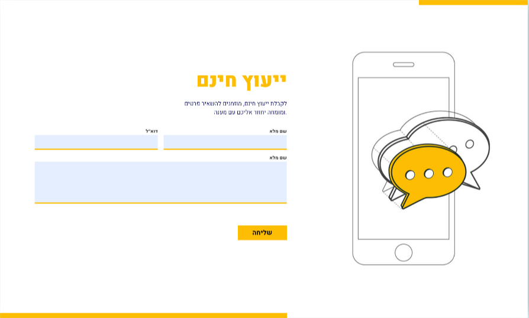

# תיק עבודות של ליאת כהן

ברוכים הבאים לתיק העבודות שלי! כאן תוכלו למצוא מגוון רחב של פרויקטים שאני עבדתי עליהם, כולל דפי נחיתה, עיצובים מותאמים אישית, ועוד.

## תוכן העניינים

1. [אודות](#אודות)
2. [פרויקטים](#פרויקטים)
3. [צור קשר](#צור-קשר)

## אודות

אני ליאת כהן, מעצבת אתרים עם תשוקה ליצירה וחדשנות. אני אוהבת לשלב עיצובים יפהפיים עם פונקציות מתקדמות, ואני מתלהבת ללמוד טכנולוגיות חדשות.

## פרויקטים

-1. **[קפה לבוקר רגוע](../projects/project_one/passingPage.html)**

- 
- דף נחיתה שמציג קופון לקבלת קפה בחינם.

2. **[Here & Now](../projects/project_two/passingPage.html)**

   - 
   - דף נחיתה לקופון מתנות מפנק במיוחד.

3. **[תן לנו להוביל אותך קדימה](../projects/project_three/passingPage.html)**

   - 
   - דף נחיתה זה נבנה ועוצב על-ידי HTML ו-CSS.

4. **[תנו לנו להוביל אותך קדימה](../projects/project_four/passingPage.html)**

   - 
   - דף נחיתה זה נבנה ועוצב על-ידי HTML ו-CSS.

5. **[לגלות את העולם](../projects/project_five/passingPage.html)**

   - 
   - דף נחיתה הבנוי מ-HTML ו-CSS.

6. **[ייעוץ חינם](../projects/project_six/passingPage.html)**
   - 
   - דף נחיתה הבנוי מ-HTML ו-CSS.

# פרויקטי JavaScript

ברוך הבא לאוסף של פרויקטי HTML ו-JavaScript! הפרויקטים כוללים מגוון של משחקים, יישומים ואפליקציות אינטרנטיות שבנויים באמצעות HTML, CSS ו-JavaScript.

## תוכן העניינים

1. [משחק תלוי אדם - Hangman](#משחק-תלוי-אדם---hangman)
2. [משחק נחש - Snake](#משחק-נחש---snake)
3. [בונה מסך](#בונה-מסך)
4. [תחזית מזג האוויר - Weather API](#תחזית-מזג-האויר---weather-api)
5. [Pokedex API](#pokedex-api)
6. [משחק חשבון - Oron Math Game](#משחק-חשבון---oron-math-game)

## 1. משחק תלוי אדם - Hangman

### תיאור:

משחק תלוי אדם (Hangman) בו המשתמש צריך לנחש מילים מתוך אוצר מילים של סדרות וסרטים. המילים מוצגות כקו תחתון, והמשתמש מנחש אותיות באמצעות מקלדת. כל תשובה שגויה מוסיפה שלב בתמונה של הדמות התלויה.

### טכנולוגיות:

- HTML
- CSS
- JavaScript

---

## 2. משחק נחש - Snake

### תיאור:

משחק נחש קלאסי בו המשתמש שולט בנחש באמצעות חיצי המקלדת או על ידי החלקה על המסך במובייל. המטרה היא לאכול פירות ולהימנע מהמכשולים.

### טכנולוגיות:

- HTML
- CSS
- JavaScript

---

## 3. בונה מסך

### תיאור:

בונה מסך המאפשר למשתמש ליצור אלמנטים עם רקע, גודל, תוכן וצבע מותאמים אישית. המשתמש יכול לשמור את העיצוב או לאפס אותו בעזרת כפתורים מתאימים.

### טכנולוגיות:

- HTML
- CSS
- JavaScript

---

## 4. תחזית מזג האוויר - Weather API

### תיאור:

יישום שמציג תחזית מזג האוויר על פי עיר שהמשתמש מכניס. היישום משתמש ב-API של מזג האוויר כדי להציג נתונים כמו טמפרטורה, תחושת חום, תיאור מצב מזג האוויר, ותחזית להמשך היום.

### טכנולוגיות:

- HTML
- CSS
- JavaScript
- API (מזג אוויר)

---

## 5. Pokedex API

### תיאור:

יישום שמאפשר למשתמש לחפש מידע על פוקימונים על פי שם או ID. המשתמש יכול להזין את שם הפוקימון או את מזהה ה-ID שלו ולקבל מידע על הפוקימון כמו שם, תיאור, כוח, ותמונה.

### טכנולוגיות:

- HTML
- CSS
- JavaScript
- API (Pokedex)

---

## 6. משחק חשבון - Oron Math Game

#

## צור קשר

להתעניינות בפרטים נוספים, אתם מוזמנים לפנות אלי דרך האימייל שלי: [liat667788@gmail.com](mailto:liat667788@gmail.com) או דרך WhatsApp: [לחצו כאן](https://wa.link/pzffcv).

---

&copy; כל הזכויות שמורות לליאת כהן
